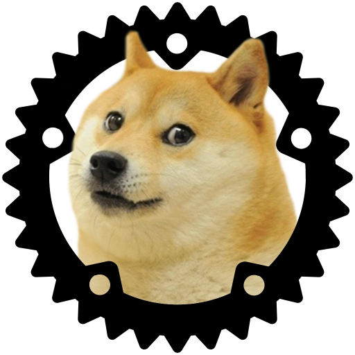
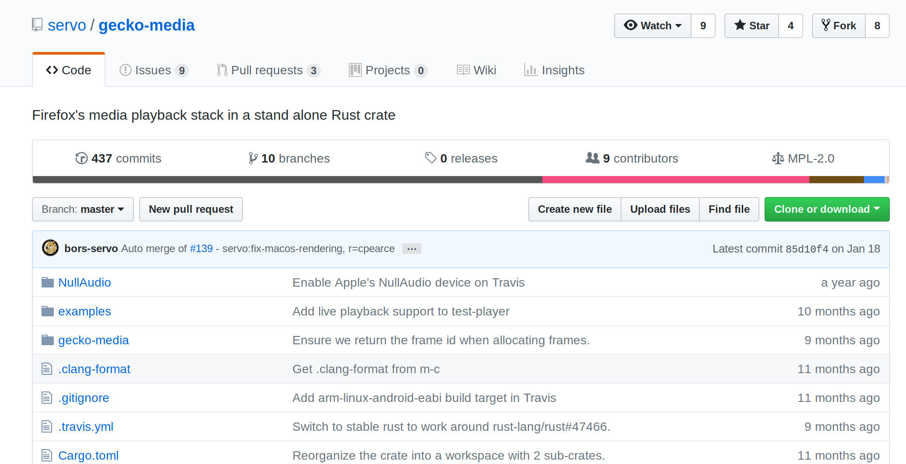
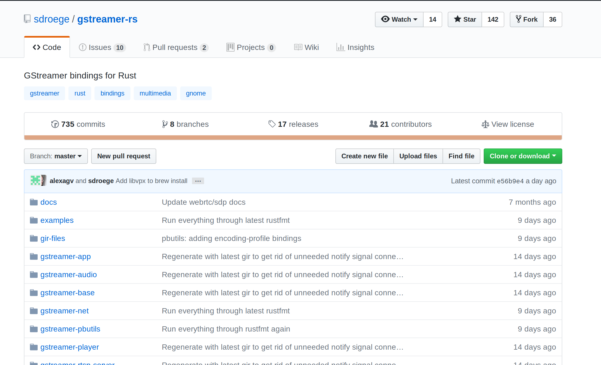

<!--

(3m) Introduce Servo and Rust
(3m) Overview of webaudio API, performance requirements
(3m) servo-media abstraction boundaries:

    (1m) abstraction boundary between servo-media and DOM
    (1m) abstraction boundary between gstreamer and servo-media
    (1m) Process isolation discussion

(6m) Overview of using gstreamer-rs from servo-media

    (1m) Choice of gstreamer-rs, previous attempt with gecko-media
    (2m) file decoding
    (1m) AppSrc vs BaseSrc
    (2m) AppSrc sink design, event loop backpressure mechanism

(4-5m) servo-media design overview

    (1m) Basic primitives: Blocks, Chunks, Ticks
    (1m) Node abstraction
    (1m) Graph abstraction, petgraph
    (1m) AudioParams

(2m) Using servo-media from Rust code
(2m) Status and future plans
-->


### Using GStreamer for Servo's WebAudio implementation in Rust

<small> &mdash; Manish Goregaokar (@Manishearth)</small>


♫

(Introduce self and stuff if not introduced already)

Hi, I'm Manish. I work on the experimental Servo browser engine.

We've recently been working on WebAudio support, and we're using GStreamer for all of the decoding/playback.

§
</img>

♫

So ... what's Servo?

The core of a web browser is the "browser engine". Browser engines handle things like parsing the source for the webpage, running javascript, applying CSS, laying out the page, and rendering the result.

Currently, most browser engines are complex beasts written in C++, and are highly single-threaded. This isn't great; browsers are something we use a lot, and ideally they would use the full power of the CPUs available to them.

Sadly, it's _hard_ to write safe, multithreaded code for such large codebases. But modern processors support a lot of parallelism, and we're missing out if we don't make use of that. We should find a way to fix this!


Enter Rust!

§§
</img>


♫

Rust is a relatively new systems programming language incubated at Mozilla. Its goals are speed, safety, and fearless concurrency.

One of its main selling points is that it makes it possible to easily write safe systems code, with or without parallelism. This makes it ideal for improving the state of browser development; and this was indeed one of the reasons Mozilla incubated it in the first place!

§§
</img>

♫ 

So Servo's an experimental browser engine written primarily in Rust, which uses parallelism wherever it can.

It's a testing ground for new ideas, and a place from where we can eventually upstream code into Firefox. We're also hoping to get it to users as part of Firefox Reality, so we need to support things common in WebVR environments -- like audio!


⏰=1m

§

### Webaudio

 - Audio playback, decoding, processing, and synthesis from Javascript
 - Supported by Firefox, Chrome, Edge, Safari, and many other browsers.
 - Modular routing based model for processing audio
 - Primarily for audio processing (use `audio` for playback)


♫ 

Webaudio is a Web API for playing, decoding, processing, and synthesizing audio from Javascript. These days it's pretty widely supported.

It uses a modular routing model for audio processing.

Typically `<audio>` elements are used for simple audio playback, and you use WebAudio for when you're looking to do some audio processing.

§

### Modular routing

<br><br>
<svg width="800pt"  viewBox="0.00 0.00 474.45 44.00" xmlns="http://www.w3.org/2000/svg" xmlns:xlink="http://www.w3.org/1999/xlink"> <g id="graph0" class="graph" transform="scale(1 1) rotate(0) translate(4 40)"> <title>G</title> <polygon fill="transparent" stroke="transparent" points="-4,4 -4,-40 470.447,-40 470.447,4 -4,4"/> <!-- OscillatorNode --> <g id="node1" class="node"> <title>OscillatorNode</title> <ellipse fill="none" stroke="#000000" cx="70.0298" cy="-18" rx="70.0596" ry="18"/> <text text-anchor="middle" x="70.0298" y="-13.8" font-family="Times,serif" font-size="14.00" fill="#000000">OscillatorNode</text> </g> <!-- GainNode --> <g id="node2" class="node"> <title>GainNode</title> <ellipse fill="none" stroke="#000000" cx="226.7814" cy="-18" rx="50.9444" ry="18"/> <text text-anchor="middle" x="226.7814" y="-13.8" font-family="Times,serif" font-size="14.00" fill="#000000">GainNode</text> </g> <!-- OscillatorNode&#45;&gt;GainNode --> <g id="edge1" class="edge"> <title>OscillatorNode&#45;&gt;GainNode</title> <path fill="none" stroke="#000000" d="M140.153,-18C148.73,-18 157.4402,-18 165.8668,-18"/> <polygon fill="#000000" stroke="#000000" points="165.9766,-21.5001 175.9766,-18 165.9766,-14.5001 165.9766,-21.5001"/> </g> <!-- DestinationNode --> <g id="node3" class="node"> <title>DestinationNode</title> <ellipse fill="none" stroke="#000000" cx="389.975" cy="-18" rx="76.4439" ry="18"/> <text text-anchor="middle" x="389.975" y="-13.8" font-family="Times,serif" font-size="14.00" fill="#000000">DestinationNode</text> </g> <!-- GainNode&#45;&gt;DestinationNode --> <g id="edge2" class="edge"> <title>GainNode&#45;&gt;DestinationNode</title> <path fill="none" stroke="#000000" d="M277.5223,-18C285.6596,-18 294.2771,-18 302.9768,-18"/> <polygon fill="#000000" stroke="#000000" points="303.2035,-21.5001 313.2035,-18 303.2034,-14.5001 303.2035,-21.5001"/> </g> </g> </svg>
<br>
<script type="text/audiosample">
let o = new OscillatorNode(cx);
let g = new GainNode(cx);
g.gain.value = 0.5;
o.connect(g);
g.connect(cx.destination);
o.start();
</script>
<br><br><br>

♫ 

Webaudio's model lets the user create various nodes and connect them up. Blocks of audio are produced by source nodes, processed by various intermediate nodes, and eventually sent to the destination node which renders them.

Here, we have a simple oscillator node (by default a sine wave at 440 Hz), connected up to a gain node with gain 0.5, which yields the processed audio to the destination node, playing it. It sounds like this.

§§

### Modular routing: Mixing

<!--
digraph G {
    rankdir="LR";
    OscillatorNode;
    GainNode;
    OscillatorNode2;
    DestinationNode;
    OscillatorNode:e->GainNode:w;
    GainNode:e->DestinationNode:w;
    OscillatorNode2:e->DestinationNode:w;
}
-->
<br>
<svg width="800pt" viewBox="0.00 0.00 522.72 98.00" xmlns="http://www.w3.org/2000/svg" xmlns:xlink="http://www.w3.org/1999/xlink"> <g id="graph0" class="graph" transform="scale(1 1) rotate(0) translate(4 94)"> <title>G</title> <polygon fill="transparent" stroke="transparent" points="-4,4 -4,-94 518.7201,-94 518.7201,4 -4,4"/> <!-- OscillatorNode --> <g id="node1" class="node"> <title>OscillatorNode</title> <ellipse fill="none" stroke="#000000" cx="70.0298" cy="-72" rx="70.0596" ry="18"/> <text text-anchor="middle" x="70.0298" y="-67.8" font-family="Times,serif" font-size="14.00" fill="#000000">OscillatorNode</text> </g> <!-- GainNode --> <g id="node2" class="node"> <title>GainNode</title> <ellipse fill="none" stroke="#000000" cx="250.9179" cy="-72" rx="50.9444" ry="18"/> <text text-anchor="middle" x="250.9179" y="-67.8" font-family="Times,serif" font-size="14.00" fill="#000000">GainNode</text> </g> <!-- OscillatorNode&#45;&gt;GainNode --> <g id="edge1" class="edge"> <title>OscillatorNode:e&#45;&gt;GainNode:w</title> <path fill="none" stroke="#000000" d="M140.0298,-72C162.9037,-72 171.0347,-72 189.7622,-72"/> <polygon fill="#000000" stroke="#000000" points="189.918,-75.5001 199.9179,-72 189.9179,-68.5001 189.918,-75.5001"/> </g> <!-- DestinationNode --> <g id="node4" class="node"> <title>DestinationNode</title> <ellipse fill="none" stroke="#000000" cx="438.2482" cy="-45" rx="76.4439" ry="18"/> <text text-anchor="middle" x="438.2482" y="-40.8" font-family="Times,serif" font-size="14.00" fill="#000000">DestinationNode</text> </g> <!-- GainNode&#45;&gt;DestinationNode --> <g id="edge2" class="edge"> <title>GainNode:e&#45;&gt;DestinationNode:w</title> <path fill="none" stroke="#000000" d="M301.9179,-72C327.3407,-72 331.7474,-51.5123 351.7519,-46.2303"/> <polygon fill="#000000" stroke="#000000" points="352.2771,-49.6922 361.7762,-45 351.4243,-42.7443 352.2771,-49.6922"/> </g> <!-- OscillatorNode2 --> <g id="node3" class="node"> <title>OscillatorNode2</title> <ellipse fill="none" stroke="#000000" cx="250.9179" cy="-18" rx="74.7168" ry="18"/> <text text-anchor="middle" x="250.9179" y="-13.8" font-family="Times,serif" font-size="14.00" fill="#000000">OscillatorNode2</text> </g> <!-- OscillatorNode2&#45;&gt;DestinationNode --> <g id="edge3" class="edge"> <title>OscillatorNode2:e&#45;&gt;DestinationNode:w</title> <path fill="none" stroke="#000000" d="M325.7762,-18C341.7137,-18 342.411,-35.1453 352.1571,-42.1105"/> <polygon fill="#000000" stroke="#000000" points="351.192,-45.4751 361.7762,-45 353.2059,-38.771 351.192,-45.4751"/> </g> </g> </svg>
<br>
<script type="text/audiosample">
let o = new OscillatorNode(cx);
let o2 = new OscillatorNode(cx);
o2.frequency.value = 100;
let g = new GainNode(cx);
g.gain.value = 0.5;
o.connect(g);
g.connect(cx.destination);
o2.connect(cx.destination);
o.start();
o2.start();
</script>
<br><br><br><br><br>

♫ 

One can connect outputs from multiple nodes to a single input of some node, which causes the audio to be mixed with unity gain to a single block of audio with a number of channels determined by the number of channels in each output as well as various configurable settings of the node receiving the audio.

In this example, we mix two signals of discordant frequencies, one of which has had its volume reduced.

§§

### Modular routing: Parameters

<!--
    digraph G {
    rankdir="LR";
    splines=ortho;
    OscillatorNode[pos="0,0!"];
    GainNode[pos="2,0!"];
    OscillatorNode2[pos="2,1!"];
    DestinationNode[pos="4,0!"];
    OscillatorNode->GainNode->DestinationNode;
    OscillatorNode2:s->GainNode:n[xlabel="gain   "];
}
-->
<br>
<svg width="800pt" viewBox="0.00 0.00 442.00 116.00" xmlns="http://www.w3.org/2000/svg" xmlns:xlink="http://www.w3.org/1999/xlink"> <g id="graph0" class="graph" transform="scale(1 1) rotate(0) translate(4 112)"> <title>G</title> <polygon fill="transparent" stroke="transparent" points="-4,4 -4,-112 438,-112 438,4 -4,4"/> <!-- OscillatorNode --> <g id="node1" class="node"> <title>OscillatorNode</title> <ellipse fill="none" stroke="#000000" cx="70" cy="-18" rx="70.0596" ry="18"/> <text text-anchor="middle" x="70" y="-13.8" font-family="Times,serif" font-size="14.00" fill="#000000">OscillatorNode</text> </g> <!-- GainNode --> <g id="node2" class="node"> <title>GainNode</title> <ellipse fill="none" stroke="#000000" cx="214" cy="-18" rx="50.9444" ry="18"/> <text text-anchor="middle" x="214" y="-13.8" font-family="Times,serif" font-size="14.00" fill="#000000">GainNode</text> </g> <!-- OscillatorNode&#45;&gt;GainNode --> <g id="edge1" class="edge"> <title>OscillatorNode&#45;&gt;GainNode</title> <path fill="none" stroke="#000000" d="M140.3126,-18C140.3126,-18 153.1677,-18 153.1677,-18"/> <polygon fill="#000000" stroke="#000000" points="153.1677,-21.5001 163.1677,-18 153.1676,-14.5001 153.1677,-21.5001"/> </g> <!-- DestinationNode --> <g id="node4" class="node"> <title>DestinationNode</title> <ellipse fill="none" stroke="#000000" cx="358" cy="-18" rx="76.4439" ry="18"/> <text text-anchor="middle" x="358" y="-13.8" font-family="Times,serif" font-size="14.00" fill="#000000">DestinationNode</text> </g> <!-- GainNode&#45;&gt;DestinationNode --> <g id="edge2" class="edge"> <title>GainNode&#45;&gt;DestinationNode</title> <path fill="none" stroke="#000000" d="M264.769,-18C264.769,-18 271.4354,-18 271.4354,-18"/> <polygon fill="#000000" stroke="#000000" points="271.4355,-21.5001 281.4354,-18 271.4354,-14.5001 271.4355,-21.5001"/> </g> <!-- OscillatorNode2 --> <g id="node3" class="node"> <title>OscillatorNode2</title> <ellipse fill="none" stroke="#000000" cx="214" cy="-90" rx="74.7168" ry="18"/> <text text-anchor="middle" x="214" y="-85.8" font-family="Times,serif" font-size="14.00" fill="#000000">OscillatorNode2</text> </g> <!-- OscillatorNode2&#45;&gt;GainNode --> <g id="edge3" class="edge"> <title>OscillatorNode2:s&#45;&gt;GainNode:n</title> <path fill="none" stroke="#000000" d="M214,-72C214,-72 214,-46 214,-46"/> <polygon fill="#000000" stroke="#000000" points="217.5001,-46 214,-36 210.5001,-46 217.5001,-46"/> <text text-anchor="middle" x="197.4821" y="-46.4" font-family="Times,serif" font-size="14.00" fill="#000000">gain &#160;&#160;</text> </g> </g> </svg>
<br>
<script type="text/audiosample">
let o = new OscillatorNode(cx);
let o2 = new OscillatorNode(cx);
o2.frequency.value = 1;
let g = new GainNode(cx);
o.connect(g);
g.connect(cx.destination);
o2.connect(g.gain);
o.start();
o2.start();
</script>
<br><br><br><br><br>

♫ 

Many nodes have "parameters" -- the frequency of an OscillatorNode, the gain value of a GainNode, the 3D position of a PannerNode, the playback rate of an AudioBufferSourceNode are all parameters. One can set a constant value to these, or assign a behavior to them (they can follow a curve, ramp to a value, etc).

Another thing one can do is connect the output of a node to a parameter itself, thus controlling its value. In this example, the gain applied to one signal itself follows a low-frequency sine wave resulting in a tone with a varying volume.


§

### Features of WebAudio

 - Generating periodic waves (sine, square, etc) including custom periodic waves <!-- .element: class="fragment" -->
 - Playing buffers of audio <!-- .element: class="fragment" -->
 - Manipulating gain, delay, channels <!-- .element: class="fragment" -->
 - 3D audio panning <!-- .element: class="fragment" -->
 - Various filters (low-pass, high-pass, band-pass, notch, etc) including custom filters <!-- .element: class="fragment" -->
 - Playing to hardware as well as rendering to a buffer <!-- .element: class="fragment" -->

♫ 


Overall, WebAudio has a pretty wide feature set.

It supports ¶

Generating periodic waves of various kinds, including custom periodic waves supplied via their fourier transform.

It also supports playing buffers of raw audio.


One can manipluate the gain of some audio, apply a delay to it, or even manipulate its its channels.

There's support for applying various filters to a stream of audio, e.g. low-pass, high-pass, band-pass, notch, etc, including custom IIR filters.

The processed output can be played realtime to hardware, but it can also be rendered to a buffer for later playback.


§

### Performance characteristics

 - Renders audio realtime at 44100Hz
 - Handles audio in "blocks" of 128 sample-frames
 - Should have very low latency
 - Should render continuously

♫ 

Webaudio typically is supposed to render realtime audio at 44,100Hz. It's possible to render audio "offline" to a buffer at different sample rates. Audio is processed in blocks of 128 sample-frames (a sample frame is effectively one thirty two bit floating point value, nominally between -1 and 1, per channel). The latency here needs to be very low -- JavaScript should be able to manipulate the audio state without there being much of a delay in seeing the effects. This is especially important for e.g. 3D panning audio.

It should also render continuously, when not rendering "offline"; there shouldn't be gaps between each block being rendered.

⏰=6m


§

### Picking a media backend


♫ 

For servo, we need a media backend to handle most of the media things. While audio processing is something we can do, we want to have more established libraries for decoding and playback of media and audio, as well as handling WebRTC.

§§

### Picking a media backend: gecko-media


</img>

♫ 

Our first attempt was the gecko-media crate.

Gecko, the browser engine behind Firefox, has its own custom media backend.

It's an attractive starting point for us -- Gecko's media backend will be feature-complete, web-compatible, and have all the performance characteristics a web browser needs for media. We extracted all the media code and got to work writing a Rust library -- a "crate" -- around it .

However, web browsers components are typically very tightly intertwined with other parts of the web browser, and Gecko's media stack is no exception. We discovered that properly extracting the media code such that it can operate independently of Gecko was a very large task, so we started looking for other options.

§§

### Picking a media backend: gstreamer-rs


</img>


♫ 

Fortunately, gstreamer exists! It's designed as a general-purpose multimedia framework, so it should satisfy our requirements! Furthermore, Sebastian Dröge has published an excellent set of Rust bindings for gstreamer and many of its plugins. These present a relatively Rust-y API for all of the features of gstreamer.

gstreamer-rs isn't feature complete, but it's actively getting there.

We tried using it as our backend and it was a very pleasant experience.

T=9m

§

### GStreamer in servo-media: Audio sink

<!--
digraph g {
    rankdir="LR";
    subgraph cluster_food {
       label="appsrc";
       OscillatorNode->GainNode->DestinationNode;
    }
    DestinationNode->audioresample->audioconvert->autoappsink;
}
-->

<br>

<svg width="1300pt" viewBox="0.00 0.00 971.45 101.00" xmlns="http://www.w3.org/2000/svg" xmlns:xlink="http://www.w3.org/1999/xlink"> <g id="graph0" class="graph" transform="scale(1 1) rotate(0) translate(4 97)"> <title>g</title> <polygon fill="transparent" stroke="transparent" points="-4,4 -4,-97 967.4479,-97 967.4479,4 -4,4"/> <g id="clust1" class="cluster"> <title>cluster_food</title> <polygon fill="none" stroke="#000000" points="8,-8 8,-85 490.447,-85 490.447,-8 8,-8"/> <text text-anchor="middle" x="249.2235" y="-68.4" font-family="Times,serif" font-size="14.00" fill="#000000">appsrc</text> </g> <!-- OscillatorNode --> <g id="node1" class="node"> <title>OscillatorNode</title> <ellipse fill="none" stroke="#000000" cx="86.0298" cy="-34" rx="70.0596" ry="18"/> <text text-anchor="middle" x="86.0298" y="-29.8" font-family="Times,serif" font-size="14.00" fill="#000000">OscillatorNode</text> </g> <!-- GainNode --> <g id="node2" class="node"> <title>GainNode</title> <ellipse fill="none" stroke="#000000" cx="242.7814" cy="-34" rx="50.9444" ry="18"/> <text text-anchor="middle" x="242.7814" y="-29.8" font-family="Times,serif" font-size="14.00" fill="#000000">GainNode</text> </g> <!-- OscillatorNode&#45;&gt;GainNode --> <g id="edge1" class="edge"> <title>OscillatorNode&#45;&gt;GainNode</title> <path fill="none" stroke="#000000" d="M156.153,-34C164.73,-34 173.4402,-34 181.8668,-34"/> <polygon fill="#000000" stroke="#000000" points="181.9766,-37.5001 191.9766,-34 181.9766,-30.5001 181.9766,-37.5001"/> </g> <!-- DestinationNode --> <g id="node3" class="node"> <title>DestinationNode</title> <ellipse fill="none" stroke="#000000" cx="405.975" cy="-34" rx="76.4439" ry="18"/> <text text-anchor="middle" x="405.975" y="-29.8" font-family="Times,serif" font-size="14.00" fill="#000000">DestinationNode</text> </g> <!-- GainNode&#45;&gt;DestinationNode --> <g id="edge2" class="edge"> <title>GainNode&#45;&gt;DestinationNode</title> <path fill="none" stroke="#000000" d="M293.5223,-34C301.6596,-34 310.2771,-34 318.9768,-34"/> <polygon fill="#000000" stroke="#000000" points="319.2035,-37.5001 329.2035,-34 319.2034,-30.5001 319.2035,-37.5001"/> </g> <!-- audioresample --> <g id="node4" class="node"> <title>audioresample</title> <ellipse fill="none" stroke="#000000" cx="585.7941" cy="-34" rx="67.1946" ry="18"/> <text text-anchor="middle" x="585.7941" y="-29.8" font-family="Times,serif" font-size="14.00" fill="#000000">audioresample</text> </g> <!-- DestinationNode&#45;&gt;audioresample --> <g id="edge3" class="edge"> <title>DestinationNode&#45;&gt;audioresample</title> <path fill="none" stroke="#000000" d="M482.4953,-34C491.0835,-34 499.8384,-34 508.437,-34"/> <polygon fill="#000000" stroke="#000000" points="508.44,-37.5001 518.44,-34 508.44,-30.5001 508.44,-37.5001"/> </g> <!-- audioconvert --> <g id="node5" class="node"> <title>audioconvert</title> <ellipse fill="none" stroke="#000000" cx="750.5909" cy="-34" rx="61.3993" ry="18"/> <text text-anchor="middle" x="750.5909" y="-29.8" font-family="Times,serif" font-size="14.00" fill="#000000">audioconvert</text> </g> <!-- audioresample&#45;&gt;audioconvert --> <g id="edge4" class="edge"> <title>audioresample&#45;&gt;audioconvert</title> <path fill="none" stroke="#000000" d="M653.2988,-34C661.7036,-34 670.3222,-34 678.7891,-34"/> <polygon fill="#000000" stroke="#000000" points="679.017,-37.5001 689.017,-34 679.017,-30.5001 679.017,-37.5001"/> </g> <!-- autoappsink --> <g id="node6" class="node"> <title>autoappsink</title> <ellipse fill="none" stroke="#000000" cx="905.7442" cy="-34" rx="57.9081" ry="18"/> <text text-anchor="middle" x="905.7442" y="-29.8" font-family="Times,serif" font-size="14.00" fill="#000000">autoappsink</text> </g> <!-- audioconvert&#45;&gt;autoappsink --> <g id="edge5" class="edge"> <title>audioconvert&#45;&gt;autoappsink</title> <path fill="none" stroke="#000000" d="M812.3574,-34C820.7083,-34 829.3145,-34 837.7664,-34"/> <polygon fill="#000000" stroke="#000000" points="837.9717,-37.5001 847.9717,-34 837.9716,-30.5001 837.9717,-37.5001"/> </g> </g> </svg>

<br><br><br>

♫ 


For WebAudio, we take the aforementioned audio processing pipeline, and put it "inside" a gstreamer appsrc. The appsrc requests blocks of audio from servo-media, and servo-media runs the audio processing graph a block at a time, pushing these blocks into the appsink.


§§


### GStreamer in servo-media: AppSrc

 - rendering via `gst_app_src_push_buffer()` (`AppSrc::push_buffer()`)
 - avoid blocking via `gst_app_src_get_current_level_bytes()`  (`AppSrc::get_current_level_bytes()`)

♫ 

The AppSrc is the core part of the audio sink, we use `push_buffer()` to provide audio to it.

We set `max_bytes` of the AppSrc to `1`, this way we can asynchronously push up to one block to the AppSrc's queue. We only push more when the queue has space. This is functionally equivalent to using a blocking AppSrc, however we wish to push data from the same thread that does the processing and handling of incoming messages, so the AppSrc is non-blocking and we manually check for a full queue. We also set up the AppSrc's `need_data` callback to re-request processing if it empties.

The `max_bytes` could potentially be increased to trade off some latency in the processing thread for eager processing, if this turns out to be an issue.


§§


### GStreamer in servo-media: BaseSrc

 - Pull-based model
 - Pleasant, trait-based API
 - Needs much more code ☹️

♫ 

Before we used an AppSrc for audio playback, we tried a BaseSrc. It had a pull-based model so we didn't need to handle the scheduling ourselves, however it ultimately ended up being a lot more code. Sebastian mentioned that AppSrc is much better suited for our use case since we just need the ability to push buffers to the gstreamer pipeline; so we switched. The gstreamer-rs BaseSrc API, however, is quite nicely done using Rust traits.

§§

### GStreamer in servo-media: Audio decoding

<br>

<svg width="948pt" height="44pt" viewBox="0.00 0.00 948.03 44.00" xmlns="http://www.w3.org/2000/svg" xmlns:xlink="http://www.w3.org/1999/xlink"> <g id="graph0" class="graph" transform="scale(1 1) rotate(0) translate(4 40)"> <title>g</title> <polygon fill="transparent" stroke="transparent" points="-4,4 -4,-40 944.0314,-40 944.0314,4 -4,4"/> <!-- appsrc --> <g id="node1" class="node"> <title>appsrc</title> <ellipse fill="none" stroke="#000000" cx="36.2373" cy="-18" rx="36.4761" ry="18"/> <text text-anchor="middle" x="36.2373" y="-13.8" font-family="Times,serif" font-size="14.00" fill="#000000">appsrc</text> </g> <!-- decodebin --> <g id="node2" class="node"> <title>decodebin</title> <ellipse fill="none" stroke="#000000" cx="159.1972" cy="-18" rx="50.9464" ry="18"/> <text text-anchor="middle" x="159.1972" y="-13.8" font-family="Times,serif" font-size="14.00" fill="#000000">decodebin</text> </g> <!-- appsrc&#45;&gt;decodebin --> <g id="edge1" class="edge"> <title>appsrc&#45;&gt;decodebin</title> <path fill="none" stroke="#000000" d="M72.7964,-18C80.8357,-18 89.5593,-18 98.2681,-18"/> <polygon fill="#000000" stroke="#000000" points="98.4429,-21.5001 108.4429,-18 98.4429,-14.5001 98.4429,-21.5001"/> </g> <!-- audioconvert --> <g id="node3" class="node"> <title>audioconvert</title> <ellipse fill="none" stroke="#000000" cx="307.3695" cy="-18" rx="61.3993" ry="18"/> <text text-anchor="middle" x="307.3695" y="-13.8" font-family="Times,serif" font-size="14.00" fill="#000000">audioconvert</text> </g> <!-- decodebin&#45;&gt;audioconvert --> <g id="edge2" class="edge"> <title>decodebin&#45;&gt;audioconvert</title> <path fill="none" stroke="#000000" d="M210.1897,-18C218.4328,-18 227.0997,-18 235.7225,-18"/> <polygon fill="#000000" stroke="#000000" points="235.7967,-21.5001 245.7966,-18 235.7966,-14.5001 235.7967,-21.5001"/> </g> <!-- audioresample --> <g id="node4" class="node"> <title>audioresample</title> <ellipse fill="none" stroke="#000000" cx="472.1663" cy="-18" rx="67.1946" ry="18"/> <text text-anchor="middle" x="472.1663" y="-13.8" font-family="Times,serif" font-size="14.00" fill="#000000">audioresample</text> </g> <!-- audioconvert&#45;&gt;audioresample --> <g id="edge3" class="edge"> <title>audioconvert&#45;&gt;audioresample</title> <path fill="none" stroke="#000000" d="M369.2026,-18C377.4489,-18 385.9887,-18 394.4621,-18"/> <polygon fill="#000000" stroke="#000000" points="394.7406,-21.5001 404.7406,-18 394.7406,-14.5001 394.7406,-21.5001"/> </g> <!-- capsfilter --> <g id="node5" class="node"> <title>capsfilter</title> <ellipse fill="none" stroke="#000000" cx="622.4747" cy="-18" rx="46.9226" ry="18"/> <text text-anchor="middle" x="622.4747" y="-13.8" font-family="Times,serif" font-size="14.00" fill="#000000">capsfilter</text> </g> <!-- audioresample&#45;&gt;capsfilter --> <g id="edge4" class="edge"> <title>audioresample&#45;&gt;capsfilter</title> <path fill="none" stroke="#000000" d="M539.8454,-18C548.2829,-18 556.8472,-18 565.1074,-18"/> <polygon fill="#000000" stroke="#000000" points="565.3753,-21.5001 575.3752,-18 565.3752,-14.5001 565.3753,-21.5001"/> </g> <!-- deinterleave --> <g id="node6" class="node"> <title>deinterleave</title> <ellipse fill="none" stroke="#000000" cx="763.6573" cy="-18" rx="58.4435" ry="18"/> <text text-anchor="middle" x="763.6573" y="-13.8" font-family="Times,serif" font-size="14.00" fill="#000000">deinterleave</text> </g> <!-- capsfilter&#45;&gt;deinterleave --> <g id="edge5" class="edge"> <title>capsfilter&#45;&gt;deinterleave</title> <path fill="none" stroke="#000000" d="M669.4865,-18C677.7311,-18 686.4605,-18 695.1478,-18"/> <polygon fill="#000000" stroke="#000000" points="695.2952,-21.5001 705.2951,-18 695.2951,-14.5001 695.2952,-21.5001"/> </g> <!-- appsink --> <g id="node7" class="node"> <title>appsink</title> <ellipse fill="none" stroke="#000000" cx="898.955" cy="-18" rx="41.1529" ry="18"/> <text text-anchor="middle" x="898.955" y="-13.8" font-family="Times,serif" font-size="14.00" fill="#000000">appsink</text> </g> <!-- deinterleave&#45;&gt;appsink --> <g id="edge6" class="edge"> <title>deinterleave&#45;&gt;appsink</title> <path fill="none" stroke="#000000" d="M822.2139,-18C830.6501,-18 839.2785,-18 847.5612,-18"/> <polygon fill="#000000" stroke="#000000" points="847.8274,-21.5001 857.8274,-18 847.8274,-14.5001 847.8274,-21.5001"/> </g> </g> </svg>

<br><br><br>

♫ 

WebAudio supports decoding audio data. We handle this by pushing formatted audio to an `appsrc` element, which goes through a decoding pipeline, ultimately hitting an `appsink` whose callbacks we hook into to extract the decoded audio.

We currently support decoding from existing buffers, but we plan to support the gradual decoding of audio being loaded over the network, as this is required to support `MediaElementAudioSourceNode`, a source node which allows WebAudio to pull audio from HTML media elements. This will likely be done via a separate mechanism, relying on the existing support for audio playback.


§§

### GStreamer in servo-media: Video/audio playback

 - for `<audio>` and `<video>`
 - Uses gstreamer-player crate
 - Has callbacks for new frames


♫ 

So far, I've only talked about WebAudio. But we also wish to support `<audio>` and `<video>` elements, and want to use GStreamer for their implementation as well.

We use the gstreamer-player crate for media playback. We hook into sink callbacks on new sample-frames, convert them into an intermediate frame format, and pass them on to the application.


⏰=13


§

### Servo-media design


♫ 


Servo-media has been designed to be reasonably modular, and usable outside of a browser. Furthermore, we've abstracted away the backend so that users can choose to use their own backends.

The design is heavily inspired by Gecko's Webaudio handling.

§§

### Servo-media design: Blocks

```rust
/// We render audio in blocks of size FRAMES_PER_BLOCK
///
/// A single block may contain multiple channels
#[derive(Clone, Serialize, Deserialize)]
pub struct Block {
    /// The number of channels in this block
    channels: u8,
    /// This is an optimization which means that the buffer is representing multiple channels with the
    /// same content at once. Happens when audio is upmixed or when a source like
    /// an oscillator node has multiple channel outputs
    repeat: bool,
    /// If this vector is empty, it is a shorthand for "silence"
    /// It is possible to obtain an explicitly silent buffer via .explicit_silence()
    ///
    /// This must be of length channels * FRAMES_PER_BLOCK, unless `repeat` is true,
    /// in which case it will be of length FRAMES_PER_BLOCK
    buffer: Vec<f32>,
}
```


♫ 

The basic building block of servo-media is the "Block". This is a single render quantum of audio, that is, 128 sample-frames of multichannel audio. We have some optimizations here -- silent blocks take up no memory, and blocks with the same content in each channel don't need to repeat the content. Outside code doesn't usually need to see this optimization and can request per-channel views of the data regardless of representation.


§§

### Servo-media design: Ticks

```rust
/// A tick, i.e. the time taken for a single frame
#[derive(Copy, Clone, Eq, PartialEq, Ord, PartialOrd, Debug)]
pub struct Tick(pub u64);
```


♫ 

"Tick"s are used to denote the time taken for a single sample-frame. We use a newtype to avoid confusions with other integer types, as well as confusions between measures of times in seconds. While the WebAudio APIs all deal with things in terms of seconds, we convert this to Ticks as quickly as possible.


§§

### Servo-media design: Chunks


```rust
/// A collection of blocks received as input by a node
/// or outputted by a node.
///
/// This will usually be a single block.
///
/// Some nodes have multiple inputs or outputs, which is
/// where this becomes useful. Source nodes have an input
/// of an empty chunk.
pub struct Chunk {
    pub blocks: SmallVec<[Block; 1]>,
}


impl AudioNodeEngine for FooNode {
    fn process(&mut self, mut inputs: Chunk, info: &BlockInfo) -> Chunk {
        // process inputs, yield outputs
    }
    // ...
}

```


♫ 

Individual nodes can have multiple inputs or outputs. So as not to complicate the API, nodes implement a `process()` method that processes data as `Chunk`s. The input `Chunk` will have the number of blocks equal to the number of inputs  -- this is usually 1, zero for source nodes, but can be more for some special nodes. The output `Chunk` must have a number of blocks equal to the number of outputs (this is usually 1).


§§

### Servo-media design: Nodes


```rust
/// This trait represents the common features of all audio nodes.
pub(crate) trait AudioNodeEngine: Send + AudioNodeCommon {
    fn process(&mut self, inputs: Chunk, info: &BlockInfo) -> Chunk;

    /// Messages specific to this node
    fn message_specific(&mut self, _: AudioNodeMessage, _sample_rate: f32) {}

    fn input_count(&self) -> u32 { 1 }
    fn output_count(&self) -> u32 { 1 }


    fn get_param(&mut self, _: ParamType) -> &mut Param {
        panic!("No params on node {:?}", self.node_type())
    }

    // etc
}
```


♫ 

Implementing the actual nodes requires an implementation of the `AudioNodeEngine` trait. A trait is like an interface from Java, and requires certain methods to be provided (but can also specify default methods).

Here, one must implement the processing method, and if necessary one can override the input/output count, link in AudioParams, and add support for messages this node knows how to handle.

Since all the audio processing is done on a separate thread from the DOM, interacting with the nodes is all done via messages -- nodes can be created, connected, and modified via various messages that can be sent to the thread.

§§

### Servo-media design: The graph

```rust
pub struct AudioGraph {
    graph: StableGraph<Node, Edge>,
    dest_id: NodeId,
    listener_id: NodeId,
}

pub(crate) struct Node {
    node: RefCell<Box<AudioNodeEngine>>,
}

/// An edge in the graph
///
/// This connects one or more pair of ports between two
/// nodes, each connection represented by a `Connection`.
/// WebAudio allows for multiple connections to/from the same port
/// however it does not allow for duplicate connections between pairs
/// of ports
pub(crate) struct Edge {
    connections: SmallVec<[Connection; 1]>,
}

/// A single connection between ports
struct Connection {
    /// The index of the port on the input node
    /// This is actually the /output/ of this edge
    input_idx: PortIndex<InputPort>,
    /// The index of the port on the output node
    /// This is actually the /input/ of this edge
    output_idx: PortIndex<OutputPort>,
    /// When the from node finishes processing, it will push
    /// its data into this cache for the input node to read
    cache: RefCell<Option<Block>>,
}

```

♫ 

Rust isn't very good with graph-based datastructures, however the excellent `petgraph` library is able to handle this quite well. Each node contains a node engine, and has an id which outside code can use to refer to the node. Edges between nodes list the "ports" they connect -- nodes can have multiple inputs and outputs so it's important that we identify which ones they are. The API uses zero-sized marker types, which have no runtime cost, for differentiating input and output ports to help avoid mistakes.

Our graph abstraction deals with walking the graph for processing, and provides nicer internal APIs for connecting/disconnecting nodes.


@@ is listing this code necessary? maybe explicitly call out that you shouldn't read it


§§

### Servo-media design: AudioParams

@@ todo (maybe exclude this slide)


§§

### Servo-media design: Backend abstraction


```rust
pub trait AudioSink {
    type Error: Debug;
    fn init(
        &self,
        sample_rate: f32,
        render_thread_channel: Sender<AudioRenderThreadMsg>,
    ) -> Result<(), Self::Error>;
    fn has_enough_data(&self) -> bool;
    fn push_data(&self, chunk: Chunk) -> Result<(), Self::Error>;

    fn play(&self) -> Result<(), Self::Error>;
    fn stop(&self) -> Result<(), Self::Error>;
    // ...
}

pub trait AudioDecoder {
    type Error: Debug;
    fn decode(
        &self,
        data: Vec<u8>,
        callbacks: AudioDecoderCallbacks<Self::Error>,
        options: Option<AudioDecoderOptions>,
    );
}


```

♫ 

We've deliberately abstracted away the media backend so that other users can try using other backends. For example, if Firefox wishes to use our webaudio code, they can do so whilst continuing to use the bulk of their media stack.

The backend is abstracted into two traits (there's a third trait for media playback). The `AudioSink` trait deals with playing audio: we call `push_data` to provide audio to be played, and `has_enough_data` controls the backpressure, halting further processing till necessary.

The `AudioDecoder` trait lets servo-media queue up a buffer of formatted audio to be decoded. The decoding process works through a set of callbacks that gradually receive the raw audio buffer.

T=19

§

### Using servo-media

```rust
// context creation
let context = servo_media.create_audio_context(Default::default());

// create and configure nodes
let osc = context.create_node(
    AudioNodeInit::OscillatorNode(Default::default()),
    Default::default(),
);
let mut options = GainNodeOptions::default();
options.gain = 0.5;
let gain = context.create_node(AudioNodeInit::GainNode(options), Default::default());

// connect nodes
let dest = context.dest_node();
context.connect_ports(osc.output(0), gain.input(0));
context.connect_ports(gain.output(0), dest.input(0));

// start playing
context.message_node(
    osc,
    AudioNodeMessage::AudioScheduledSourceNode(AudioScheduledSourceNodeMessage::Start(0.)),
);
```

♫ 

servo-media has a Rust API that's deliberately close to the WebAudio API, but internally message-based. It's used by instantiating an audio context, which internally sets up the processing thread, as well as any backend state. Then, one can request the creation of nodes, and connect them up. There are various messages you can send nodes -- like asking them to start, or modifying their parameters.

This library is designed to be drop-in in Servo; Servo has to do a very small amount of work to use features from this library since most of it is abstracted away. It's also designed to be useful for other users -- if people want to process audio using a WebAudio-like API in Rust, this crate can do it!

§

### Status

 - Support for most of the nodes (Oscillator, Gain, BufferSource, Analyser, ChannelMerger, ChannelSplitter, BiquadFilter, Panner) <!-- .element: class="fragment" -->
 - Support for most AudioParams <!-- .element: class="fragment" -->
 - Support for AudioListeners <!-- .element: class="fragment" -->
 - Integration in Servo of all supported features <!-- .element: class="fragment" -->
 - Lots of test failures ☹️ <!-- .element: class="fragment" -->


♫ 

(read slides)

@@ write better-structured paragraph version of this for slide notes

§

### Future plans

 - Support all nodes except AudioWorklet <!-- .element: class="fragment" -->
 - Support all AudioParams <!-- .element: class="fragment" -->
 - Full graph processing algorithm <!-- .element: class="fragment" -->
 - Pass all conformance tests <!-- .element: class="fragment" -->

♫ 

(read slides)

§
### Acknowledgements

Thank you:

 - Fernando Jiménez Moreno for co-authoring servo-media
 - Víctor Manuel Jáquez Leal for player support
 - Sebastian Dröge for writing gstreamer-rs
 - Sebastian Dröge and Philippe Normand for answering all our questions
 - Josh Matthews and Fernando Jiménez Moreno for reviewing this talk 

♫ 

@@ may be better to just list names idk (also thank someone for inviting? idk)

§
### Thank you!

 - Short words: https://twitter.com/Manishearth
 - Long words: https://manishearth.github.io

T=21
